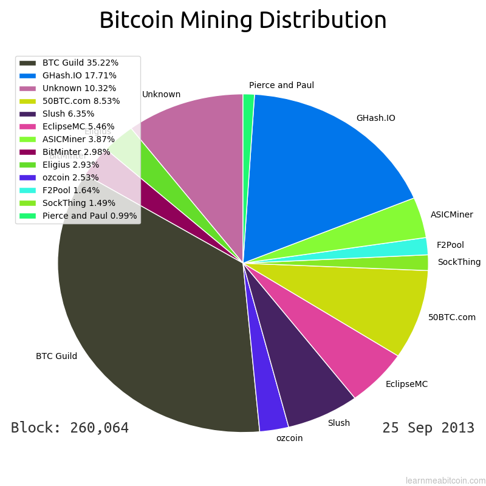
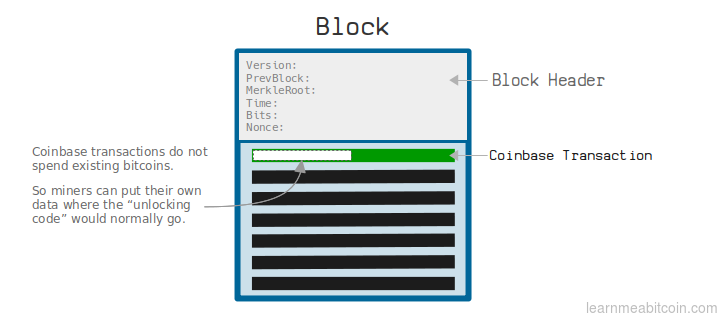
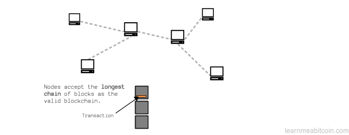
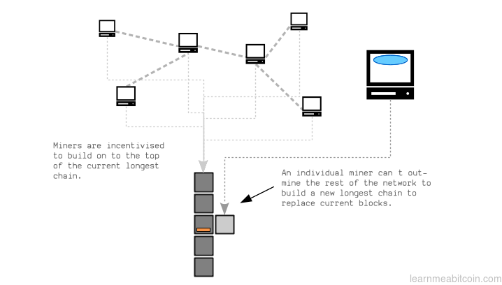
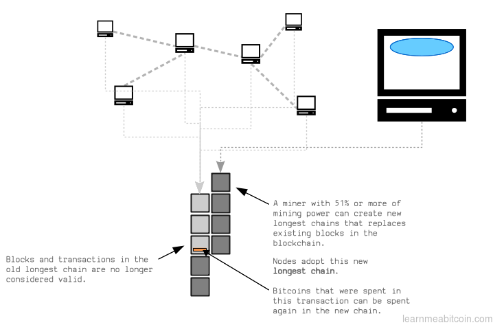

# Bitcoin Mining Distribution

This code allows you to identify who mined the blocks in your blockchain, and plot pie charts so that you can see the **most dominant miners over the history of Bitcoin**.

**EXAMPLE: <https://twitter.com/in3rsha/status/1159468260661895169>**



In other words, this tool shows you how close miners have come to controlling 51% or more of the blocks in any given 2-week period.

**TIP:** Miners are identified using the coinbase signatures in [`known_miners.json`](known_miners.json)

## Install (Linux)

Just clone the code.

```
git clone https://github.com/in3rsha/bitcoin-mining-distribution.git
```

### Dependencies

#### 1. bitcoind

This tool uses your _local blockchain_ as its source of data. So if you're not running bitcoin already, install `bitcoind` and run it for a few days to download your copy of the blockchain:

```
sudo apt install bitcoind
bitcoind --daemon
```

#### 2. bitcoin-iterate

Next, we use [`bitcoin-iterate`](https://github.com/rustyrussell/bitcoin-iterate) to extract the neccessary block data from your blockchain files (in `~/.bitcoin/blocks`):

```
git clone https://github.com/rustyrussell/bitcoin-iterate.git
cd bitcoin-iterate/
make
sudo mv bitcoin-iterate /usr/local/bin/
rm -rf bitcoin-iterate/
```

#### 3. Python + Matplotlib

We then use a Python script to decode this data and create pie charts using Matplotlib. You probably have both of these installed already.

**NOTE:** The Python script in this repo is **_not_ currently compatible with Python 3**.

#### 4. Gifsicle

Lastly we create a cool animated gif of these pie charts using [Gifsicle](https://www.lcdf.org/gifsicle/):

```
sudo apt install gifsicle
```

## Usage

Make sure you have `bitcoind` running (so that `bitcoin-cli` is available), then run these scripts in the following order:

```
# 1. Get the blockchain data we need, which will get stored in a data/ directory.
bash bitcoin-iterate.sh

# 2. Run the main script to identify who mined each block, and save the pie charts to the charts/ directory.
python main.py

# 3. Create a gif from the individual pie charts.
bash gifsicle.sh
```

After running each of these scripts you will have:

1. `data/all.csv` - Block and coinbase transaction data for every block.
2. `charts/*.png` - Individual pie charts for every difficulty period (roughly 2 week intervals)
3. `mining-distribution.gif` - An animated gif of the entire mining distribution history.

_**NOTE:** The individual pie charts of mining distribution are created for the blocks mined during a **target adjustment period** (every 2016 blocks). When the [target](https://learnmeabitcoin.com/guide/target) adjusts, the counters are reset._

## How does this work?

This tool gathers block data from your local blockchain, using `bitcoin-iterate` to grab the data and `bitcoin-cli` to decode it.

It then compares the data inside each block against a list of [`known_miners.json`](known_miners.json) to figure out who mined them.

### How can you identify who mined a block?

When a bitcoin miner constructs a block, they place a special transaction at the top of the block called a [**coinbase transaction**](https://learnmeabitcoin.com/guide/coinbase-transaction). This transaction is special because it allows a miner to send themselves a fixed amount of bitcoins that did not already exist (called the _block reward_).

However, whereas in a typical transaction you _have to select and unlock_ some existing bitcoins, this does not happen in a coinbase transaction. As a result, every coinbase transaction has some "redundant" space where the "`unlocking code`" for existing bitcoins would have normally gone.



This free space is called the "coinbase", and miners can put up to `100 bytes` of any data they like in to it. For example, Satoshi put the following in to the coinbase of the first block:

```
The Times 03/Jan/2009 Chancellor on brink of second bailout for banks
```

However, most major miners place their own unique text in the coinbase as a way of "signing" the block (figuratively, not cryptographically). Thanks to this data you can ascribe most blocks to a specific miner or mining pool.

Here are some more examples:

```
0      [...]The Times 03/Jan/2009 Chancellor on brink of second bailout for banks
233030 [...]BitMinter[...]
280806 [...]Happy NY! Yours GHash.IO
294664 [...]Mined by BTC Guild[...]
331672 [...]NOTHING BIG CAME OUT OF SOMETHING SMALL
362391 [...]New Horizons is 23267747 km to Pluto.[...]
377133 [...]Mined by AntPool[...]
416236 [...]Sun Chun Yu: Zhuang Yuan, will you marry me?[...]
```

_**NOTE:** Sometimes you need to look at the **destination address** in the coinbase transaction to identify a miner. For example, GHash.IO used the address `1CjPR7Z5ZSyWk6WtXvSFgkptmpoi4UM9BC` to collect the block reward, but did not always put their name inside the coinbase._

## Why are these charts interesting?

Because if someone is mining 51% or more of blocks, they have the ability to "undo" transactions that have been written to the blockchain.

This is known as a **51% attack**.

In short, the blockchain is just a series of blocks built on top of each other, and these blocks contain transactions. Everyone agrees that the "correct" version of the blockchain is the one with the **longest chain of blocks**. Therefore, if you wanted to _remove_ a transaction from the blockchain, you would need to rebuild a longer chain of blocks to replace the current one.



However, because anyone in the world can become a miner, and every miner will naturally want to build upon the longest chain of blocks (to claim valid block rewards), it's difficult for any individual to out-mine the network and build a longer chain of blocks to replace the existing one.



However, if a single miner has the ability to mine more blocks than the rest of the network combined (i.e. over 50%), then they then also have the ability to build longer chains that other nodes will adopt, therefore "undoing" blocks that have already been mined. In other words, they have the ability to create chains that remove blocks and transactions from the blockchain.



Now, as bad as this sounds it isn't necessarily the end of the world, because the incentive to continue to build upon the longest chain and claim block rewards is probably greater than the benefit of "undoing" a transaction (not to mention the effect it would have on the current value of bitcoin). Nonetheless, the risk would still be there, which is why it's preferable that we see that no single miner is mining more than 50% of blocks at any given time.

## FAQ

### What do the colors mean?

Nothing at all. I just gave each miner a random color (by hashing their name and taking the last six characters as a hex color value).

It's just a coincidence if two miners are a similar color.

### How reliably have you identified who mined each block?

Not 100% reliably, because miners can put whatever data they like in the coinbase field.

For example, a miner could remain somewhat anonymous by not putting any text in there at all, or they could put in the name of a completely _different_ miner (if they wanted to).

With this tool I'm just working with whatever data has been put in to the coinbase, so it's not an exact science.

## Wasn't slushpool the first mining pool?

Yes, but they [didn't mark their blocks at the start](https://twitter.com/slush/status/1159700373701050368).

This tool only looks in the coinbase field to identify miners, which is why _Eligius_ shows up as the first mining pool instead.

## Links

I identified each miner's unique coinbase signatures by browsing through the coinbase transactions manually, which was great fun. These resources were also helpful:

* [blockchain.info's pools.json](https://raw.githubusercontent.com/blockchain/Blockchain-Known-Pools/master/pools.json) (known pools)
* [denpamusic's pools.json](https://gist.github.com/denpamusic/e90929485be3282ce0aebd4f2fd1f709) (known pools)
* <https://en.bitcoin.it/wiki/Pooled_mining> (list of mining pools)
  * <https://en.bitcoin.it/wiki/KnCMiner> (example of coinbase signature information)

If you're interested in checking out coinbase messages, I display them at the top of each block in my blockchain explorer:

* [Genesis Block](https://learnmeabitcoin.com/explorer/block/000000000019d6689c085ae165831e934ff763ae46a2a6c172b3f1b60a8ce26f)

Here's some further information on coinbase transactions and mining:

* [learnmeabitcoin.com - Coinbase Transaction](https://learnmeabitcoin.com/guide/coinbase-transaction)
* [learnmeabitcoin.com - Target](https://learnmeabitcoin.com/guide/target)

And some other interesting links:

* <https://en.bitcoin.it/wiki/Majority_attack>
* <https://bitcoin.stackexchange.com/questions/80870/what-is-the-maximum-number-of-bytes-the-coinbase-scriptsig-coinbaseaux-can-hol>
* <https://coin.dance/blocks/today>
